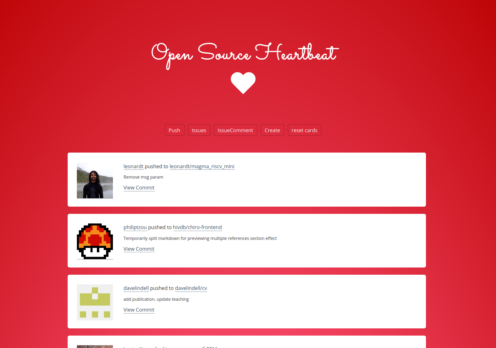

# Open Source Heartbeat

A GitHub action to generate a web interface to show GitHub activity for a subset
of users or organizations.

 - the interface is created under docs/
 - events are populated in docs/_events
 - the site is served via Jekyll

This means that you can use the action in your workflows too,
and choose how often / when to run it, and how to update your GitHub pages.
Continue reading to learn more.



## Getting Started

If you have a custom set of users or organizations, you'll need to first generate a 
users.txt file (or a differently named file that you'll specify as the `users_file` for your action.
As an alternative, you can have this file generated or updated via the GitHub action first
by specifying the `query` argument. For help building your query, it's recommended to try
your search in the [GitHub Advanced](https://github.com/search/advanced) view. For example,
to search users for the location being "Stanford" I might use the query `location%3AStanford`.

## Inputs

### `users_file`

**Optional** The path to the users.txt (or otherwise named) file that has
a single GitHub username per line. These are the users that will have their
events parsed to show on the website.

```
username1
username2
...
usernameN
```

If you define the `query` variable this file will be updated, or created first
if it doesn't exist.

### `query`

**Optional** If defined, we will use [update-users.py](scripts/update-users.py)
to first update the users.txt based on your query. For example,
to search users for the location being "Stanford" I might use the query `location%3AStanford`.
For help building your query, it's recommended to try your search in the 
[GitHub Advanced](https://github.com/search/advanced) view. If this variable
is not defined, the update will be skipped, and you will be required to already
have a users.txt file.

### `exclude_users_file`

**Optional** The path to the exclude-users.txt (or otherwise named) file that has
a single GitHub username per line for users to not include. For example, if we discover
a username via a query but then don't want to add it (e.g., the user has requested
not being added) it will not be included. This file has the same format
as the users.txt file - one username per line.

```
username1
username2
...
usernameN
```

### `token`

Your GitHub token is required to define in the environment to increase query
limits for the GitHub API.


## Supporting Scripts

If you want to update the users.txt file manually (and via the same method
done for the action) you can do that via:

```
$ python scripts/update-users.py --help
Present working directory is /home/vanessa/Desktop/Code/rseng/stanford-issues/scripts
usage: update-users.py [-h] [--version] [--users-file USERS_FILE] [--exclude-users-file EXCLUDE_USERS_FILE]
                       [--user-query USER_QUERY]

Open Source Heartbeat

optional arguments:
  -h, --help            show this help message and exit
  --version             suppress additional output.
  --users-file USERS_FILE
                        The users.txt file with GitHub usernames on lines.
  --exclude-users-file EXCLUDE_USERS_FILE
                        A list of users to never add (that might still be discovered).
  --user-query USER_QUERY
                        The string portion of a user query, generate with
                        https://github.com/search/advanced.
```

For example:

```bash
$ python scripts/update-users.py --users-file users.txt --user-query "location%3AStanford"
...
users file: users.txt
users file: exclude-users.txt
Found 24 new users!
```


## Example usage

In the example usage below, you should update the `master` branch to a versioned
release.

```yaml
    steps:
    - name: Checkout Code
      uses: actions/checkout@v2
    - name: Generate OpenSource Heartbeat Interface
      uses: rseng/opensource
      with:
        users_file: 'users.txt'
        collection: 'docs/_events'
        query: 'location%3AStanford'
        token: ${{ secrets.GITHUB_TOKEN }}
```


## Questions

## How do I customize the interface?

The interface will always be generated in the docs subfolder, so
if you haven't created it there yet, the action will generate
it the first time around. It's up to you to add all or a subset of
files in docs/* or docs/_events after the content is generated.
For example, you could add both docs and _issues
in a next step that will commit to an existing or new branch:

```
git add docs/*
git add docs/_issues/*
```

This means that after the original docs is added and merged,
you should be able to customize or otherwise update the template
to your liking. The folder won't be edited if it already exists
beyond the _events folder.

Do you have an example? Please contribute by opening an issue or a pull request!
